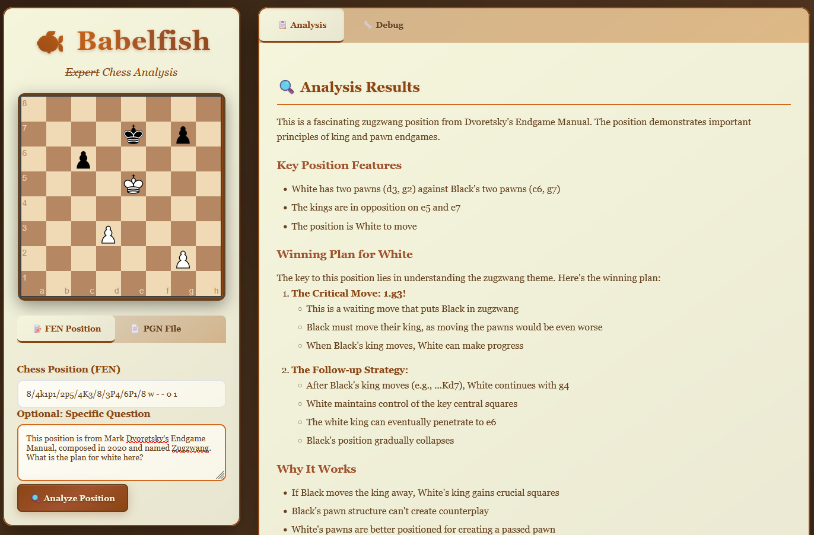

# Babelfish 🐟

**"Speak to your chess engine"**

Babelfish is a chess analysis tool that uses Stockfish via MCP (Model Context Protocol) to provide context-rich analysis of chess positions and games. It bridges the gap between powerful chess engines and language models, making chess analysis more accessible and conversational.

## Features

- 📊 **Position Analysis** - Deep analysis of chess positions using Stockfish
- 🎯 **Move Suggestions** - Get the best moves with explanations
- 📚 **Game Analysis** - Analyze complete games move by move
- 🗣️ **Human-Readable Explanations** - Convert engine output into natural language
- 🔌 **MCP Integration** - Works seamlessly with Claude Desktop and other MCP clients

## Installation

This project uses `uv` for dependency management:

```bash
# Clone the repository
git clone <repository-url>
cd babelfish

# Install dependencies
uv sync

# Install Stockfish engine
# Ubuntu/Debian:
sudo apt install stockfish

# macOS:
brew install stockfish

# Windows:
# Download from https://stockfishchess.org/download/
```

## Usage

### Web Interface (Recommended)

The most user-friendly way to use Babelfish is through its web interface. This provides an intuitive chat-based interface for chess analysis.



#### Quick Start

1. **Set up your OpenRouter API key**:
   ```bash
   export OPENROUTER_API_KEY="your-api-key-here"
   ```

2. **Start the web interface**:
   ```bash
   uv run python start_web.py
   ```

3. **Open your browser** and go to `http://localhost:5000`

#### Model Recommendations and Costs

**⚠️ Important Cost Warning**: Using OpenRouter models incurs costs based on token usage. Monitor your usage to avoid unexpected charges.

**Recommended Model**: Based on testing, `openai/o1` provides the best chess analysis quality, offering superior positional understanding and tactical insights compared to other models.

**Alternative Models**: You can also try:
- `anthropic/claude-3.5-sonnet` - Good balance of cost and quality
- `openai/gpt-4o` - Strong general performance
- `meta-llama/llama-3.1-70b-instruct` - More cost-effective option

#### Features

- **Interactive Chat Interface**: Ask questions about positions in natural language
- **Visual Chess Board**: See positions and moves clearly displayed
- **Real-time Analysis**: Get instant feedback on positions and moves
- **Game Analysis**: Upload PGN files or input move sequences
- **Multiple Model Support**: Choose from various AI models via OpenRouter

#### Example Usage

Once the web interface is running, you can:

- **Analyze a position**: "What's the best move in this position: rnbqkbnr/pppp1ppp/8/4p3/4P3/8/PPPP1PPP/RNBQKBNR w KQkq e6 0 2"
- **Evaluate moves**: "Is Nf3 a good move here?"
- **Get strategic advice**: "What's the plan for White in this position?"
- **Analyze games**: Paste PGN notation or describe a game sequence

### Standalone Demo

Run the demo to test the chess analyzer:

```bash
python main.py
```

### MCP Server Mode

Start the MCP server for integration with other tools:

```bash
python main.py --mcp
```

### Claude Desktop Integration

#### Standard Setup (Same System)

To use Babelfish with Claude Desktop in stdio mode on the same system:

1. **Install Stockfish** (see installation section above)

2. **Configure Claude Desktop** by adding this to your `claude_desktop_config.json`:

```json
{
  "mcpServers": {
    "babelfish": {
      "command": "uv",
      "args": ["run", "python", "main.py", "--mcp"],
      "cwd": "/path/to/your/babelfish"
    }
  }
}
```

**Note:** Replace `/path/to/your/babelfish` with the actual path to your babelfish directory.

#### WSL + Windows Setup

To run Babelfish in WSL while using Claude Desktop on Windows:

1. **Install Stockfish in WSL** (see installation section above)

2. **Configure Claude Desktop on Windows** by adding this to your `claude_desktop_config.json`:

```json
{
  "mcpServers": {
    "babelfish": {
      "command": "wsl",
      "args": ["-d", "Ubuntu", "bash", "-c", "cd ~/babelfish && uv run python main.py --mcp"],
      "cwd": "C:\\"
    }
  }
}
```

**Important Notes for WSL Setup:**
- Replace `Ubuntu` with your WSL distribution name if different (check with `wsl -l` in Windows PowerShell)
- Replace `~/babelfish` with the actual path to your babelfish directory in WSL
- Make sure WSL is set up and your distribution is running
- Ensure `uv` and all dependencies are installed in the WSL environment, not Windows

**Alternative WSL Configuration** (if you have a specific WSL distribution):
```json
{
  "mcpServers": {
    "babelfish": {
      "command": "wsl.exe",
      "args": ["--distribution", "Ubuntu-22.04", "--exec", "bash", "-c", "cd ~/babelfish && uv run python main.py --mcp"]
    }
  }
}
```

3. **Configuration File Locations:**
   - **macOS**: `~/Library/Application Support/Claude/claude_desktop_config.json`
   - **Windows**: `%APPDATA%\Claude\claude_desktop_config.json`
   - **Linux**: `~/.config/Claude/claude_desktop_config.json`

4. **Restart Claude Desktop** after adding the configuration.

5. **Verify Installation** - You should see the Babelfish tools available in Claude Desktop:
   - `analyze_position` - Analyze a chess position
   - `analyze_game` - Analyze a complete game
   - `explain_position` - Get human-readable position explanations

### Example Usage in Claude Desktop

Once configured, you can ask Claude to analyze chess positions:

```
"Can you analyze this chess position: rnbqkbnr/pppp1ppp/8/4p3/4P3/8/PPPP1PPP/RNBQKBNR w KQkq e6 0 2"
```

Or analyze complete games:

```
"Please analyze this game: 1.e4 e5 2.Nf3 Nc6 3.Bb5 a6 4.Ba4 Nf6"
```

## Available MCP Tools

### `analyze_position`
Analyzes a chess position using the Stockfish engine.

**Parameters:**
- `fen` (required): Chess position in FEN notation
- `depth` (optional): Analysis depth (default: 15)

### `analyze_game`
Analyzes a complete chess game move by move.

**Parameters:**
- `moves` (required): Array of moves in standard algebraic notation

### `explain_position`
Provides human-readable explanations of chess positions.

**Parameters:**
- `fen` (required): Chess position in FEN notation

## Requirements

- Python 3.8+
- Stockfish chess engine installed on your system
- uv package manager

## Troubleshooting

### "Stockfish not found" error
Make sure Stockfish is installed and accessible from your PATH:
```bash
# Test if Stockfish is available
stockfish
```

If not available, install using your system's package manager or download from [stockfishchess.org](https://stockfishchess.org/download/).

### MCP Server not connecting
1. Verify the path in your `claude_desktop_config.json` is correct
2. Make sure you can run `uv run python main.py --mcp` from the command line
3. Check Claude Desktop logs for error messages
4. Restart Claude Desktop after configuration changes

### WSL-specific troubleshooting

#### WSL Distribution Issues
```bash
# Check available WSL distributions
wsl -l -v

# Make sure your distribution is running
wsl -d Ubuntu

# Test the command from Windows PowerShell
wsl -d Ubuntu bash -c "cd ~/babelfish && uv run python main.py --mcp"
```

#### Path and Permission Issues
```bash
# In WSL, verify the project path exists
ls -la ~/babelfish/

# Make sure uv is installed in WSL
which uv

# Test stockfish in WSL
which stockfish
stockfish
```

#### Common WSL Setup Issues
- **WSL not installed**: Install WSL2 from Microsoft Store or PowerShell: `wsl --install`
- **Distribution not running**: Start it with `wsl -d Ubuntu` (replace Ubuntu with your distro)
- **uv not found in WSL**: Install uv in WSL environment, not Windows
- **Permission errors**: Ensure the WSL user has access to the babelfish directory
- **Stockfish not available**: Install stockfish in WSL: `sudo apt install stockfish`

#### Testing the WSL Integration
From Windows Command Prompt or PowerShell:
```cmd
# Test if WSL can access the project
wsl ls ~/babelfish/

# Test if the command works
wsl -d Ubuntu bash -c "cd ~/babelfish && python main.py"
```

## Contributing

Contributions are welcome! Please feel free to submit issues and pull requests.

## License

This project is open source. Please check the LICENSE file for details.
